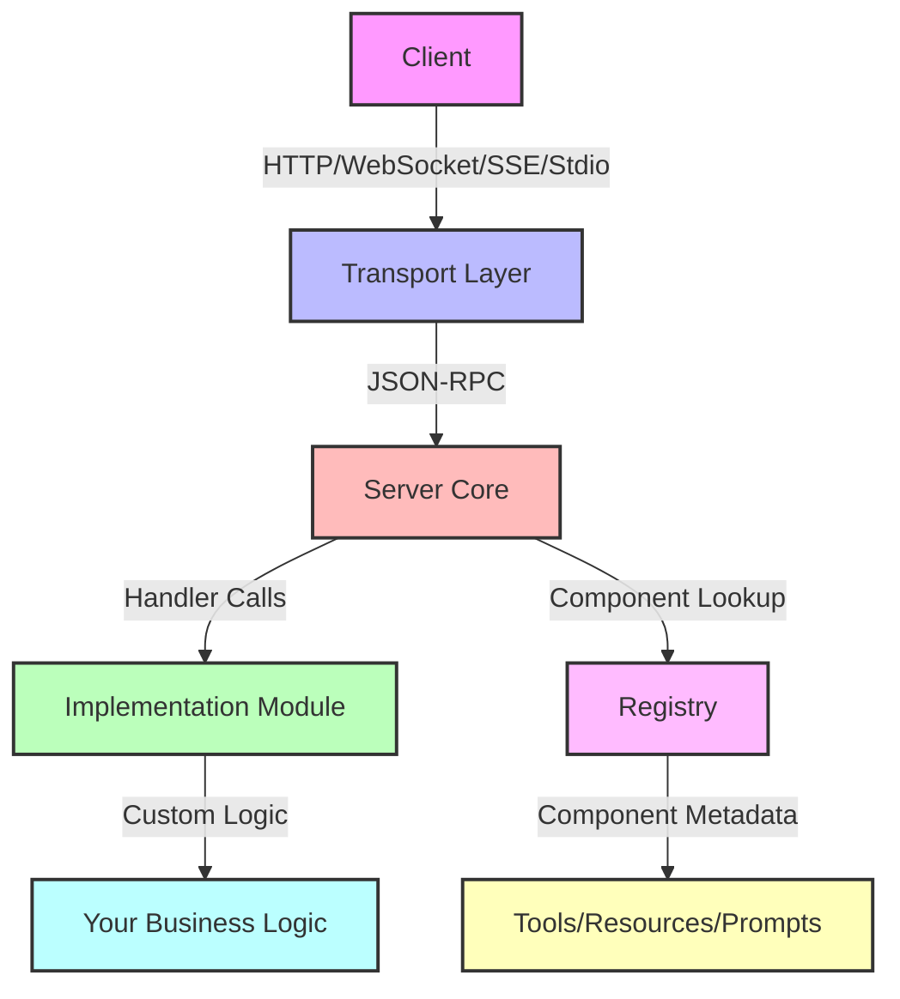
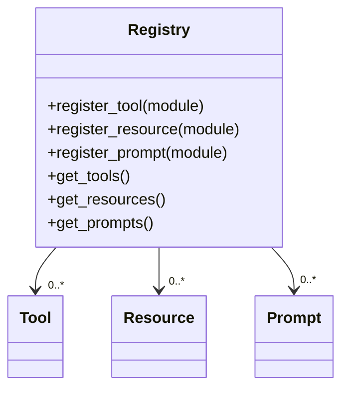
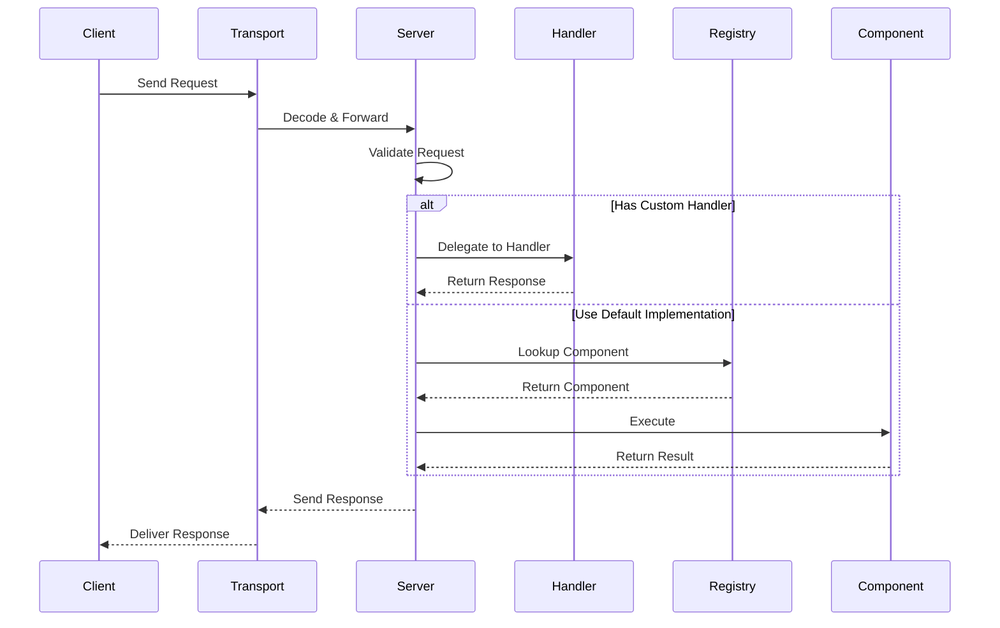

# Hermes MCP Server Implementation Guide

## Table of Contents
1. [Architecture Overview](#architecture-overview)
2. [Core Components](#core-components)
3. [Transport Layer](#transport-layer)
4. [Request Processing](#request-processing)
5. [Component Discovery](#component-discovery)
6. [Error Handling](#error-handling)
7. [Extending the Server](#extending-the-server)

## Architecture Overview

The Hermes MCP Server is built on top of Elixir's OTP framework and follows a modular, extensible architecture. The main components and their interactions are shown in the following diagram:



## Core Components

### 1. Server Core (`Hermes.Server`)

The main GenServer that handles request routing, state management, and coordination between components.

- **Responsibilities**:
  - Manages server lifecycle
  - Handles JSON-RPC request/response cycle
  - Maintains server state and configuration
  - Coordinates between transports and handlers

### 2. Registry (`Hermes.Server.Registry`)

Manages the registration and discovery of server components (tools, resources, prompts).



### 3. Transport Layer

Handles communication protocols and message serialization/deserialization.

#### Supported Transports:
1. **HTTP** - Standard HTTP/1.1 with JSON-RPC
2. **WebSocket** - Full-duplex communication
3. **SSE** (Server-Sent Events) - For server-to-client streaming
4. **Stdio** - For CLI and process-based communication

## Request Processing Flow



## Component Discovery

The server supports two methods for component discovery:

1. **Explicit Registration**:
   ```elixir
   {:ok, _pid} = Hermes.Server.start_link(
     name: MyApp.MCPServer,
     tools: [MyApp.Tools.Calculator],
     resources: [MyApp.Resources.Documentation],
     prompts: [MyApp.Prompts.Greeting]
   )
   ```

2. **Attribute-based Discovery**:
   ```elixir
   defmodule MyApp.Tools.Calculator do
     @moduledoc "A simple calculator tool"
     
     # Register as a tool with metadata
     @mcp_tool true
     @mcp_name "calculator"
     @mcp_description "Performs basic arithmetic operations"
     
     def handle(params, _context) do
       # Implementation
     end
   end
   ```

## Error Handling

The server follows the JSON-RPC 2.0 error specification with custom error codes:

| Code | Message | Description |
|------|---------|-------------|
| -32600 | Invalid Request | The JSON sent is not a valid Request object |
| -32601 | Method not found | The method does not exist / is not available |
| -32602 | Invalid params | Invalid method parameter(s) |
| -32603 | Internal error | Internal JSON-RPC error |
| -32000 to -32099 | Server error | Reserved for implementation-defined server-errors |

## Extending the Server

### Adding a New Transport

1. Create a new module implementing the `Hermes.Server.Transport.Behaviour`
2. Handle connection management and message serialization
3. Register the transport with the server

### Creating Custom Handlers

Implement the `Hermes.Server.Implementation` behaviour to provide custom request handling:

```elixir
defmodule MyApp.MCPHandler do
  @behaviour Hermes.Server.Implementation
  
  @impl true
  def handle_request(method, params, context, state) do
    # Custom request handling logic
    {:reply, result, new_state}
  end
  
  # Optional callbacks for lifecycle events
  def handle_client_capabilities(capabilities, state) do
    # Handle client capabilities
    {:ok, new_state}
  end
end
```

### Monitoring and Telemetry

The server emits telemetry events for monitoring:

- `[:hermes, :server, :request, :start]` - Request started
- `[:hermes, :server, :request, :stop]` - Request completed
- `[:hermes, :server, :request, :exception]` - Request failed

## Best Practices

1. **Stateless Handlers**: Keep handlers stateless when possible, using the server state only for configuration.
2. **Error Handling**: Always return structured errors with appropriate codes.
3. **Resource Management**: Clean up resources in the `terminate/2` callback.
4. **Testing**: Use the built-in test helpers for integration testing.
5. **Security**: Implement proper authentication and authorization in your transport layer.

## Performance Considerations

- The server is designed for high concurrency using Elixir's lightweight processes.
- Consider connection pooling for database access in handlers.
- Use streaming for large responses to reduce memory usage.
- Monitor process mailbox size for long-running operations.

## Troubleshooting

Common issues and solutions:

1. **Connection Drops**: Check transport configuration and timeouts.
2. **Memory Leaks**: Look for processes accumulating state.
3. **Performance Issues**: Profile handler execution times.
4. **Serialization Errors**: Ensure all response data is JSON-serializable.

## Examples

See the `examples/` directory for complete implementation examples, including:

- Basic server setup
- Custom transport implementation
- Advanced handler patterns
- Integration with Phoenix applications
